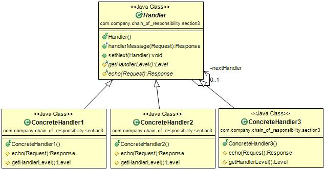
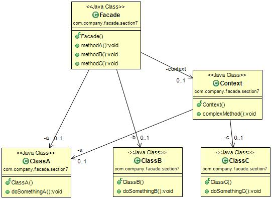
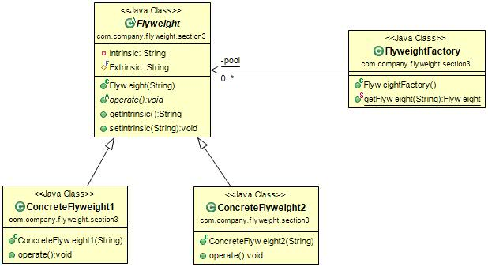
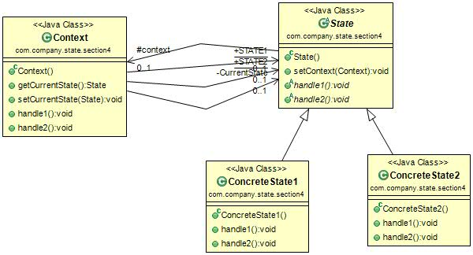

DPModel
=======

《[设计模式之禅](http://book.douban.com/subject/4260618/)》原书源码，有部分修改。存于此便于以后参考使用。

六大设计原则
-------------
*[单一职责原则](https://github.com/nivance/DPModel/tree/master/src/dp/com/company/srp)
*[依赖倒置原则](https://github.com/nivance/DPModel/tree/master/src/dp/com/company/dip)
*[接口隔离原则](https://github.com/nivance/DPModel/tree/master/src/dp/com/company/isp)
*[里氏替换原则](https://github.com/nivance/DPModel/tree/master/src/dp/com/company/lsp)
*[开闭原则](https://github.com/nivance/DPModel/tree/master/src/dp/com/company/ocp)
*[迪米特法则](https://github.com/nivance/DPModel/tree/master/src/dp/com/company/lod)

1.[适配器模式](https://github.com/nivance/DPModel/tree/master/src/dp/com/company/adapter)
-------------

2.[桥接模式](https://github.com/nivance/DPModel/tree/master/src/dp/com/company/bridge)
-------------

3.[建造者模式](https://github.com/nivance/DPModel/tree/master/src/dp/com/company/builder)
-------------

4.[责任链模式](https://github.com/nivance/DPModel/tree/master/src/dp/com/company/chain_of_responsibility)
-------------

5.[组合模式](https://github.com/nivance/DPModel/tree/master/src/dp/com/company/composite)
-------------

6.[装饰模式](https://github.com/nivance/DPModel/tree/master/src/dp/com/company/decorator)
-------------

7.[门面模式](https://github.com/nivance/DPModel/tree/master/src/dp/com/company/facade)
-------------

8.[工厂模式](https://github.com/nivance/DPModel/tree/master/src/dp/com/company/factorys)
-------------

9.[抽象工厂模式](https://github.com/nivance/DPModel/tree/master/src/dp/com/company/factorya)
-------------

10.[享元模式](https://github.com/nivance/DPModel/tree/master/src/dp/com/company/flyweight)
-------------

11.[解释器模式](https://github.com/nivance/DPModel/tree/master/src/dp/com/company/interpreter)
-------------

12.[迭代器模式](https://github.com/nivance/DPModel/tree/master/src/dp/com/company/iterator)
-------------

13.[中介模式](https://github.com/nivance/DPModel/tree/master/src/dp/com/company/mediator)
-------------

14.[备忘录模式](https://github.com/nivance/DPModel/tree/master/src/dp/com/company/memento)
-------------

15.[观察者模式](https://github.com/nivance/DPModel/tree/master/src/dp/com/company/observer)
-------------

16.[原型模式](https://github.com/nivance/DPModel/tree/master/src/dp/com/company/prototype)
-------------

17.[代理模式](https://github.com/nivance/DPModel/tree/master/src/dp/com/company/proxy)
-------------

18.[单例模式](https://github.com/nivance/DPModel/tree/master/src/dp/com/company/singleton)
-------------

19.[状态模式](https://github.com/nivance/DPModel/tree/master/src/dp/com/company/state)
-------------

20.[策略模式](https://github.com/nivance/DPModel/tree/master/src/dp/com/company/strategy)
-------------

21.[模板模式](https://github.com/nivance/DPModel/tree/master/src/dp/com/company/template_method)
-------------

22.[访问者模式](https://github.com/nivance/DPModel/tree/master/src/dp/com/company/visitor)
-------------

23.[MVC](https://github.com/nivance/DPModel/tree/master/src/dp/com/company/mvc)
-------------