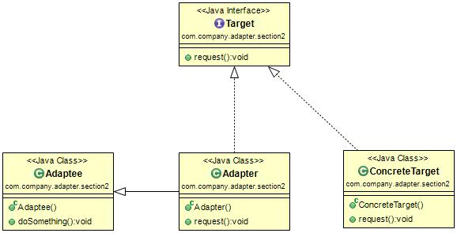

#适配器模式(Adapter Pattern)
定义：Convert the interface of a class into another interface clients expect. Adapter lets classes work together that couldn't otherwise because of incompatible interfaces.（将一个类的接口变换成客户端所期待的另一种接口，从而是原本因接口不匹配而无法在一起工作的两个类能够在一起工作。）  

适配器模式通用类图如图所示。  

 我们先来看看适配器模式的三个角色：

- Target目标角色：该角色定义把其它类转换为何种接口，也就是我们的期望接口。
- Adaptee源角色：你想把谁转换成目标角色。
- Adapter适配器角色：适配器模式的核心角色，其它两个角色都是已经存在的角色，而适配器角色是需要新建立的，它的职责非常简单，把源角色转换成目标角色，怎么转换?通过继承或类关联的方式。

#适配器模式的应用
##适配器模式的优点
 * 适配器模式可以让两个没有任何关系得类在一起运行，只要适配器这个角色能够搞定他就成。
 * 增加了类的透明性。我们访问的Target目标角色，但是具体的实现都委托给了源角色，而这些对高层次模块时透明的，也是它不需要关心的。
 * 提高了类的复用度。
 * 灵活性非常好

##适配器模式的使用场景
 适配器应用的场景只要记住一点就足够了：你有动机修改了一个已经投产中的接口时，适配器模式可能是最适合你的模式。  
  
##适配器模式的注意事项 
适配器模式最好在详细设计不要考虑它，它不是为了解决还处在开发阶段的问题，而是解决正在服役的项目问题。 