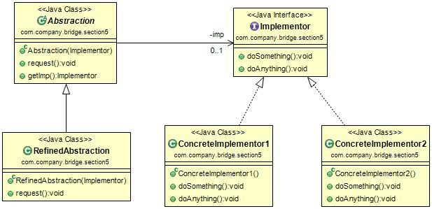

#桥梁模式(Bridge Pattern) 
定义：Decouple an abstraction from its implementation so that the two can vary independently.（将抽象和实现解耦，使得两者可以独立地变化。）  

 桥梁模式的通用类图如图所示。  

- Abstraction抽象化角色：它的主要职责是定义出该角色的行为，同时保存一个对实现化角色的引用，该角色一般是抽象类。
- Implementor实现化角色：它是接口或者抽象类，定义角色必须的行为和属性。
- RefinedAbstraction修正抽象化角色：它引用实现化角色对抽象化角色进行修正。
- ConcreteImplementor具体实现化角色：它实现接口和抽象类定义的方法和属性。

桥梁模式的几个名词比较拗口，大家只要记住一句话就成：抽象角色引用实现角色，或者说抽象角色的部分实现是由实现角色完成的。  

#桥梁模式的应用
##1.桥梁模式的优点
 * 抽象和实现分离：它完全是为了解决集成的缺点而提出的设计模式。在该模式下，实现可以不受抽象的约束，不用再绑定在一个固定的抽象层次上。
 * 优秀的扩充能力。
 * 实现细节对客户透明。客户不用关心细节的实现，它已经由抽象层通过聚合关系完成了封装。  

##2.桥梁模式的使用场景
 * 不希望或不适合使用集成的场景：例如继承层次过渡、无法更细化设计颗粒等场景，需要考虑使用桥梁模式。
 * 接口或抽象类不稳定的场景：明知道接口不稳定还想通过实现或继承来实现业务需求，那是得不偿失的，也是比较失败得作法。
 * 重用性要求较高的场景：设计的颗粒度越细，则被重用的可能性就越大，而采用继承则受父类的限制，不可能出现太细的颗粒度。
 
##3.桥梁模式的注意事项
 桥梁模式是非常简单的，使用该模式时注意考虑如何拆分抽象和实现，并不是一涉及继承就要考虑使用该模式，那还要继承干什么呢？桥梁模式的意图还是对变化的封装，尽量把可能变化的因素封装到最细、最小的逻辑单元中，避免风险扩散。因此读者在进行系统设计时，发现类的继承有N层时，可以考虑使用桥梁模式。