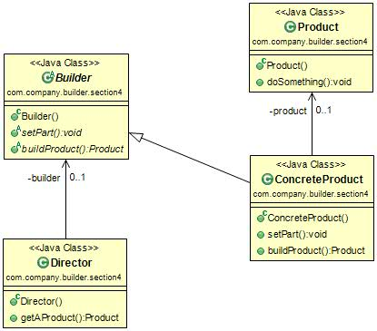

#建造者模式(Builder Pattern) 
定义：Separate the construction of a complex object from its representation so that the same construction process can create different representations. 将一个复杂对象的构建与它的表示分离，使得同样的构建过程可以创建不同的表示。     

建造者模式的通用类图如下图：  

在建造者模式中，有如下四个角色：

- Product产品类：通常是实现了模板方法模式，也就是有模板方法和基本方法，这个参考上一章节的模板方法模式。在例子中，BenzModel和BMWModel就属于产品类。
- Builder抽象建造者：规范产品的组建，一般是由子类实现。在例子中，CarBuilder属于抽象建造者。 
- ConcreteBuilder具体建造者：实现抽象类定义的所有方法，并且返回一个组件好的对象。在例子中，BenzBuilder和BMWBuilder就属于具体建造者。
- Director导演：负责安排已有模块的顺序，然后告诉Builder开始建造，在上面的例子中就是我们的老大，牛叉公司找到老大，说我要这个，这个，那个类型的车辆模型，然后老大就把命令传递给我，我和我的团队就开始拼命的建造，于是一个项目建设完毕了。 

#建造者模式的应用
##建造者模式的优点
 * 封装性。使用建造者模式可以使客户端不必知道产品内部组成的细节，如例子中我们就不需要关心每一个具体的模型内部是如何实现的，产生的对象类型就是CarModel。 
 * 建造者独立，容易扩展。
 * 便于控制细节风险。由于具体的建造者是独立的，因此可以对建造过程逐步细化，而不对其他的模块产生任何影响。 
 
##建造者模式的使用场景
 * 相同的方法，不同的执行顺序，产生不同的事件结果时，可以采用建造者模式。
 * 多个部件或零件,都可以装配到一个对象中，但是产生的运行结果又不相同时，则可以使用该模式。 
 * 产品类非常复杂，或者产品类中的调用顺序不同产生了不同的效能，这个时候使用建造者模式是非常合适。 
 * 在对象创建过程中会使用到系统中的一些其它对象，这些对象在产品对象的创建过程中不易得到时，也可以采用建造者模式封装该对象的创建过程。该种场景，只能是一个补偿方法，因为一个对象不容易获得，而在设计阶段竟然没有发觉，而要通过创建者模式柔化创建过程，本身已经违反设计最初目标。
 
##建造者模式的注意事项
建造者模式关注的是的零件类型和装配工艺（顺序），这是它与工厂方法模式最大不同的地方，虽然同为创建类模式，但是注重点不同。  

#建造者模式的扩展
已经不用扩展了，因为我们在汽车模型制造的例子中已经对建造者模式进行了扩展，引入了模板方法模式，可能大家会比较疑惑，为什么在其他介绍设计模式的书籍上创建者模式并不是这样说的，读者请注意，建造者模式中还有一个角色没有说明，就是零件，建造者怎么去建造一个对象？是零件的组装，组装顺序不同对象效能也不同，这才是建造者模式要表达的核心意义，而怎么才能更好的达到这种效果呢？引入模板方法模式是一个非常简单而有效的办法。  
大家看到这里估计就开始犯嘀咕了，这个建造者模式和工厂模式非常相似呀，Yes，是的，是非常相似，但是记住一点你就可以游刃有余的使用了：建造者模式最主要功能是基本方法的调用顺序安排，也就是这些基本方法已经实现了，通俗的说就是零件的装配，顺序不同产生的对象也不同；而工厂方法则重点是创建，创建零件时它的主要职责，你要什么对象我创造一个对象出来，组装顺序则不是他关心的。  

#最佳实践
再次说明，在使用建造者模式的时候考虑一下模板方法模式，别孤立的思考一个模式，僵化的套用一个模式会让受害无穷！

        