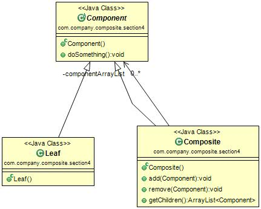

#组合模式(Composite Pattern) 
定义：Composite objects into tree structures to represent part-whole hierarchies. Composite lets clients treat individual objects and compositions of objects uniformly.（将对象组合成树形结构以表示“部分-整理”的层次结构，使得用户对单个对象和组合对象的使用具有一致性。）  

组合模式的通用类图如下图：  

我们先来说说组合模式的几个角色：

- Component抽象构件角色：定义参加组合对象的共有方法和属性，可以定义一些默认的行为或属性。
- Leaf叶子构件：叶子对象，其下再也没有其他的分支，也就是遍历的最小单位。
- Composite树枝构件：树枝对象，它的作用是组合树枝节点和叶子节点形成一个树形结构。

#组合模式的应用
##1.组合模式的优点
 * 高层模块调用简单：一颗树形机构中的所有节点都是Component，局部和整体对调用者来说没有任何区别，也就是说，高层模块不必关心自己处理的单个对象还是整个组合结构，简化了高层模块的代码。
 * 节点自由增加：使用了组合模式后，我们可以看看，如果想增加一个树枝节点、树叶节点是不是都很容易，只要找到它的父节点就成，非常容易扩展，符合开闭原则，对以后的维护非常有利。

##2.组合模式的缺点 
组合模式有一个非常明显的缺点，看到我们在场景类中的定义，提到树枝和树叶使用时的定义了吗？直接使用了实现类，这在面向接口编程上是很不恰当的，与依赖倒置原则冲突，读者在使用的时候要考虑清楚，它限制了你接口的影响范围。  

##3.组合模式的使用场景
 * 维护和展示部分—整体关系得场景，如树形菜单、文件和文件夹管理。
 * 从一个整体中能够独立出部分模块或功能的场景。
 
