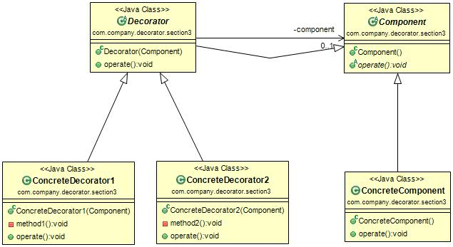

#装饰模式 (Decorate Pattern) 
定义：Attach additional responsibilities to an object dynamically keeping the same interface. Decorators provide a flexible alternative to subclassing for extending functionality.（动态地给一个对象添加一些额外的职责。就增加功能来说，装饰模式相比生产子类更为灵活。）  

装饰模式的通用类图如下图：  

在类图中，有四个角色需要说明：

- Component抽象构件：Component是一个接口或者是抽象类，就是定义我们最核心的对象，也就是最原始的对象。
- ConcreteComponent具体构件：ConcreteComponent是最核心、最原始、最基本的接口或抽象类的实现，你要装饰的就是它。
- Decorator装饰角色：一般是一个抽象类，做什么用呢？实现接口或者抽象方法，它里面可不一定有抽象的方法呀，在它的属性里必然有一个private变量指向Component抽象构件。
- 具体装饰对象：ConcreteDecorator1和ConcreteDecorator2是两个具体的装饰类，你要把最核心的、最原始的、最基本的东西装饰城其他东西。

#装饰模式的应用
##1.装饰模式的优点
 * 装饰类与被装饰类可以独立发展，而不会耦合。换句话说，Component类无须知道Decorator类，Decorator类是从外部来扩展Component类的功能，而Decorator类也不用知道具体的构件。
 * 装饰模式时继承关系得一个替代方案。我们看装饰类Decorator，不管装饰多少层，返回的对象还是Component，实现的还是is-a的关系。
 * 装饰模式可以动态地扩展一个实现类得功能。

##2.装饰模式的缺点 
对于装饰模式记住一点就足够了：多层的装饰是很复杂的。因此，尽量减少装饰类的数量，以便降低系统的复杂度。  

##3.装饰模式的使用场景
 * 需要扩展一个类的功能，或给一个类增加附加功能。
 * 需要动态地给一个对象增加功能，这些功能可以再动态地撤销。
 * 需要为一批的兄弟类进行改装或加装功能，当然是首选装饰模式。