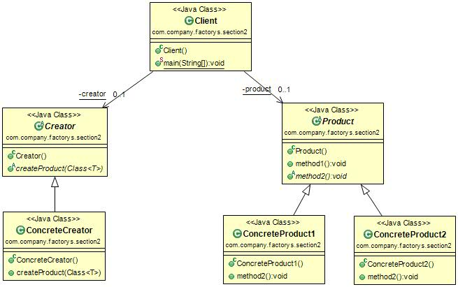

#工厂方法模式(Factory Pattern) 
定义：Define an interface for creating an object, but let subclasses decide which class to instantiate. Factory Method lets a class defer instantiation to subclasses。定义一个用于创建对象的接口，让子类决定实例化哪一个类。工厂方法使一个类的实例化延迟到其子类。

工厂方法模式的类图如下图：  

在工厂方法模式中，抽象产品类Product负责定义产品的共性，实现对事物最抽象定义；Creator为抽象创建类，也就是抽象工厂，具体如何创建产品类是由具体的实现工厂ConcreteCreator完成的。工厂方法模式的变种较多。    

#工厂方法模式的应用
##1.工厂方法模式的优点
 * 首先，良好的封装性，代码结构清晰。一个对象创建是有条件约束的，如一个调用者需要一个具体的产品对象，只要知道这个产品的类名（或约束字符串）就可以了，不用知道创建对象的艰辛过程，减少模块间的耦合。
 * 其次，工厂方法模式的扩展性非常优秀。在增加产品类的情况下，只要适当地修改具体的工厂类或扩展一个工厂类，就可以完成“拥抱变化”。
 * 再次，屏蔽产品类。这一特点非常重要，产品类的实现如何变化，调用者都不需要关心，它只需要关心产品的接口，只要接口保持不表，系统中的上层模块就不要发生变化，因为产品类的实例化工作是由工厂类负责，一个产品对象具体由哪一个产品生成是由工厂类决定的。在数据库开发中，大家应该能够深刻体会到工厂方法模式的好处：如果使用JDBC连接数据库，数据库从MySql切换到Oracle，需要改动地方就是切换一下驱动名称（前提条件是SQL语句是标准语句），其他的都不需要修改，这是工厂方法模式灵活性的一个直接案例。
 * 最后，工厂方法模式是典型的解耦框架。高层模块值需要知道产品的抽象类，其他的实现类都不用关心，符合迪米特原则，我不需要的就不要去交流；也符合依赖倒转原则，只依赖产品类的抽象；当然也符合里氏替换原则，使用产品子类替换产品父类，没问题！

##2.工厂方法模式的使用场景 
 * 首先，工厂方法模式是new一个对象的替代品，所以在所有需要生成对象的地方都可以使用，但是需要慎重地考虑是否要增加一个工厂类进行管理，增加代码的复杂度。
 * 其次，需要灵活的、可扩展的框架时，可以考虑采用工厂方法模式。万物皆对象，那万物也就皆产品类，例如需要设计一个连接邮件服务器的框架，有三种网络协议可供选择：POP3、IMAP、HTTP，我们就可以把这三种连接方法作为产品类，定义一个接口如IConnectMail，然后定义对邮件的操作方法，三个具体的产品类（也就是连接方式）进行不同的实现，再定义一个工厂方法，按照不同的传入条件，选择不同的连接方式。如此设计，可以做到完美的扩展，如某些邮件服务器提供了WebService接口，很好，我们只要增加一个产品类就可以了。
 * 再次，工厂方法模式可以用在异构项目中，例如通过WebService与一个非Java的项目交互，虽然WebService号称是可以做到异构系统的同构化，但是在实际的开发中，还是会碰到很多问题，如类型问题、WSDL文件的支持问题，等等，从WSDL中产生的对象都认为是一个产品，然后由一个具体的工厂类进行管理，减少与外围系统的耦合。
 * 最后，可以使用在测试驱动开发的框架下，例如，测试一个类A，就需要把与类A有关联关系的类B也同时产生出来，我们可以使用工厂方法模式把类B虚拟出来，避免类A与类B的耦合。目前由于JMock和EasyMock的诞生，该使用场景已经弱化了，读者可以在遇到此种情况时直接考虑使用JMock或EasyMock。 

#工厂方法模式的扩展
 * 缩小为简单工厂模式
 * 升级为多个工厂类
 * 替代单例模式
 * 延迟初始化。何为延迟初始化(Lazy initialization)?一个对象被消费完毕后，并不立刻释放，工厂类保持其初始状态，等待再次被使用。延迟初始化是工厂方法模式的一个扩展应用。