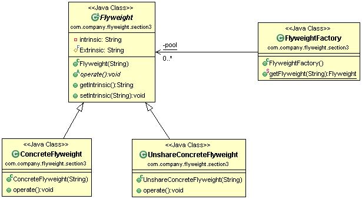

#享元模式(Flyweight Pattern) 
定义：Use sharing to support large numbers of fine-grained objects efficiently.(使用共享对象可有效地支持大量的细粒度的对象。)  

享元模式的定义为我们提出了两个要求：细粒度的对象和共享对象。要求细粒度对象，那么不可避免地使得对象数量多且性质相近，那我们就将这些对象的信息分为两个部分：内部状态(intrinsic)与外部状态(extrinsic)。

- 内部状态：内部状态是对象可共享出来的信息，存储在享元对象内部并且不会随环境改变而改变。
- 外部状态：外部状态是对象得以依赖的一个标记，是随环境改变而改变的、不可以共享的状态。

 享元模式的通用类图如图所示。  

我们先来看我们享元模式角色名称。

- Flyweight抽象享元角色：它简单地说就是一个产品的抽象类，同时定义出对象的外部状态和内部状态的接口和实现。
- ConcreteFlyweight具体享元角色：具体的一个产品类，实现抽象角色定义的业务。该角色中需要注意的是内部状态处理应该与环境无关，不应该出现一个操作改变了内部状态，同时修改了外部状态，这是绝对不允许的。
- UnsharedConcreteFlyweight不可共享的享元角色：不存在外部状态或者安全要求不能够使用共享技术的对象，该对象一般不会出现在享元工厂中。
- FlyweightFactory享元工厂：职责非常简单，就是构造一个池容器，同时提供从池中获得对象的方法。

享元模式的目的在于运用共享技术，使得一些细粒度的对象可以共享，我们的设计确实也应该这样，多使用细粒度的对象，便于重构或重用。  

#享元模式的应用
##1.享元模式的优点和缺点
享元模式是一个非常简单的模式，它可以大大减少应用程序创建的对象，降低程序内存的占用，增强程序的性能，但它同时也提高了系统复杂性，需要分离外部状态和内部状态，而且外部状态具有固化特性，不应该随内部状态改变而改变，否则导致系统的逻辑混乱。  

##2.享元模式的缺点 
 * 享元模式会引起类膨胀：每个语法都要产生一个非终结符表达式，语法规则比较复杂时，就可能产生大量的类文件，为维护带来了非常多的麻烦。
 * 享元模式采用递归调用方法：每个非终结符表达式只关心与自己有关的表达式，每个表达式需要知道最终的结果，必须一层一层地剥茧，无论是面向过程的语言还是面向对象的语言，递归都是在必要条件下使用的，它导致调试非常复杂。想想看，如果要排查一个语法错误，我们是不是要一个一个断点的调试下去，直到最小的语法单元。
 * 效率问题：享元模式由于使用了大量的循环和递归，效率是个不容忽视的问题，特别是用于解析复杂、冗长的语法时，效率是难以忍受的。  

##3.享元模式的使用场景
 * 系统中存在大量的相似对象。
 * 细粒度的对象都具备较接近的外部状态，而且外部状态与环境无关，也就是说对象没有特定身份。
 * 需要缓冲池的场景。