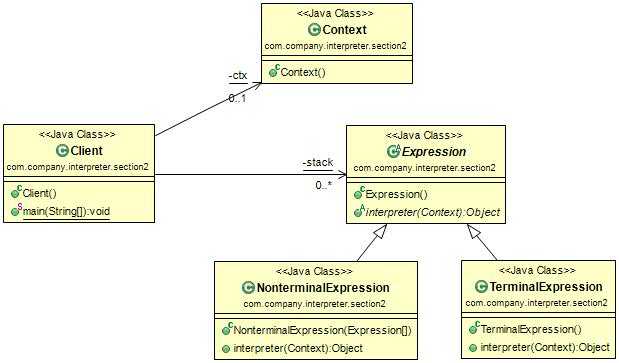

#解释器模式(Interpreter Pattern) 
定义：Given a language, define a representation for its grammar along with an interpreter that uses the representation to interpret sentences in the language。(给定一个语言, 定义它的文法的一种表示，并定义一个解释器，该解释器使用该表示来解释语言中的句子。)  

 解释器模式的通用类图如图所示。  

- AbstractExpression 抽象解释器：具体的解释任务由各个实现类完成，具体的解释器分别由TerminalExpression和NonterminalExpression完成。
- TerminalExpression终结符表达式：  实现与文法中的元素相关联的解释操作，通常一个解释器模式中只有一个终结符表达式，但有多个实例，对应不同的终结符。具体到我们例子就是VarExpression类，表达式中的每个终结符都在堆栈中产生了一个VarExpression对象。
- NonterminalExpression非终结符表达式：文法中的每条规则对应于一个非终结表达式，具体到我们的例子就是加减法规则分别对应到AddExpression和SubExpression两个类。非终结符表达式根据逻辑的复杂程度而增加，原则上每个文法规则都对应一个非终结符表达式。
- Context 环境角色：具体到我们的例子中是采用HashMap代替。

#解释器模式的应用
##1.解释器模式的优点
解释器是一个简单语法分析工具，它最显著的优点就是扩展性，修改语法规则只要修改相应的非终结符表达式就可以了，若扩展语法，则只要增加非终结符类就可以了。  

##2.解释器模式的缺点 
 * 解释器模式会引起类膨胀：每个语法都要产生一个非终结符表达式，语法规则比较复杂时，就可能产生大量的类文件，为维护带来了非常多的麻烦。
 * 解释器模式采用递归调用方法：每个非终结符表达式只关心与自己有关的表达式，每个表达式需要知道最终的结果，必须一层一层地剥茧，无论是面向过程的语言还是面向对象的语言，递归都是在必要条件下使用的，它导致调试非常复杂。想想看，如果要排查一个语法错误，我们是不是要一个一个断点的调试下去，直到最小的语法单元。
 * 效率问题：解释器模式由于使用了大量的循环和递归，效率是个不容忽视的问题，特别是用于解析复杂、冗长的语法时，效率是难以忍受的。  

##3.解释器模式的使用场景
 * 重复发生的问题可以使用解释器模式：例如，多个应用服务器，每天产生大量的日志，需要对日志文件进行分析处理，由于各个服务器的日志格式不同，但是数据要素是相同的，按照解释器的说法就是终结符表达式都是相同的，但是非终结符表达式就需要制定了。在这种情况下，可以通过程序来一劳永逸地解决该问题。
 * 一个简单语法需要解释的场景：为什么是简单？看看非终结表达式，文法规则越多，复杂度越高，而且类间还要进行递归调用（看看我们例子中的堆栈），不是一般地复杂。想想看，多个类之间的调用你需要什么样的耐心和信心去排查问题。因此，解释器模式一般用来解析比较标准的字符集，例如SQL语法分析，不过该部分逐渐被专用工具所取代。在某些特用的商业环境下也会采用解释器模式，我们刚刚的例子就是一个商业环境，而且现在模型运算的例子非常多，目前很多商业机构已经能够提供出大量的数据进行分析。 
    
    
##4.解释器模式的注意事项
尽量不要在重要的模块中使用解释器模式，否则维护会是一个很大的问题。在项目中可以使用shell、JRuby、Groovy等脚本语言来代替解释器模式，弥补Java编译型语言的不足。我们在一个银行的分析型项目中就采用JRuby进行运算处理，避免使用解释器模式的四则运算，效率和性能各方面表现良好。  

##5.最佳实践
解释器模式在实际的系统开发中使用的非常少，因为它会引起效率、性能以及维护等问题，一般在大中型的框架型项目能够找到它的身影，比如一些数据分析工具、报表设计工具、科学计算工具等等，若你确实遇到“一种特定类型的问题发生的频率足够高”的情况，准备使用解释器模式时，可以考虑一下Expression4J、MESP（Math Expression String Parser）、Jep等开源的解析工具包（这三个开源产品都可以百度、Google中搜索到，请读者自行查询），功能都异常强大，而且非常容易使用，效率也还不错，实现大多数的数学运算完全没有问题，自己没有必要从头开始编写解释器，有人已经建立了一条康庄大道，何必再走自己的泥泞小路呢？