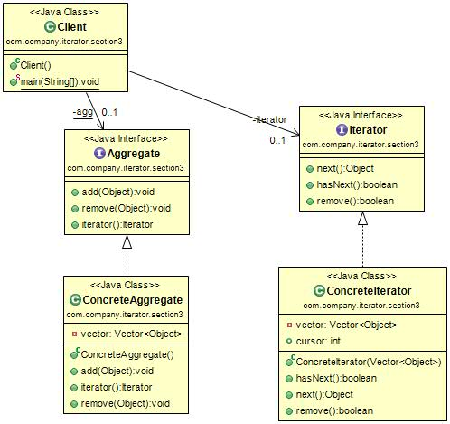

#迭代器模式(Iterator Pattern)
定义：Convert the interface of a class into another interface clients expect. Adapter lets classes work together that couldn't otherwise because of incompatible interfaces.（将一个类的接口变换成客户端所期待的另一种接口，从而是原本因接口不匹配而无法在一起工作的两个类能够在一起工作。）  

迭代器模式通用类图如图所示。  

 我们先来看看迭代器模式中的各个角色：

- Iterator抽象迭代器：抽象迭代器负责定义访问和遍历元素的接口。
- ConcreteIterator具体迭代器：具体迭代器角色要实现迭代器接口，完成容器元素的遍历。
- Aggregate抽象容器：容器角色负责提供创建具体迭代器角色的接口，必然提供一个类似createIterator()这样的方法，在Java中一般是iterator()方法。
- Concrete Aggregate具体容器：具体容器实现容器接口定义的方法，创建出容纳迭代器的对象。