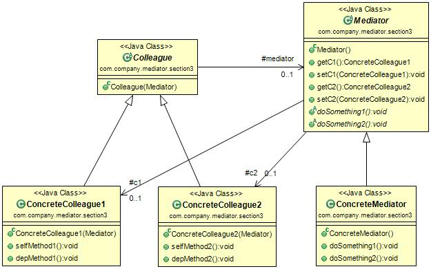

#中介者模式(Mediator Pattern) 
定义：Define an object that encapsulates how a set of objects interact. Mediator promotes loose coupling by keeping objects from referring to each other explicitly, and it lets you vary their interaction independently.（用一个中介对象封装一系列的对象交互，中介者使各对象不需要显示地相互作用，从而使其耦合松散，而且可以独立地改变它们之间的交互。）  

中介者模式的通用类图如下图：  

从类图中看，中介者模式由以下几部分组成：

- Mediator抽象中介者角色：抽象中介者角色定义统一的接口，用于个同事角色之间的通讯。
- Concrete Mediator具体中介者角色：具体中介者角色通过协调同事角色实现协作行为，因此它必须依赖于各同事角色。
- Colleague同事角色：每一个同事角色都知道中介者角色，而且与其它的同事角色通讯的时候，一定要通过中介者角色协作。每个同事类的行为分为两种：一种是同事本身的行为，比如改变对象本身的状态，处理自己的行为等，这种方法叫做自发行为(Self-Method)，与其它的同事类或中介者没有任何的依赖；第二种是必须依赖中介者才能完成的行为，叫做依赖方法(Dep-Method)。

#中介者模式应用
##1.中介者模式的优点
 中介者模式的优点就是减少类间的依赖，把原有的一对多的依赖变成了一对一的依赖，同事类只依赖中介者，减少了依赖，当然同时也降低了类间的耦合。  

##2.中介者模式的缺点 
中介者模式的缺点就是中介者会膨胀得很大，而且逻辑复杂，原本N个对象直接的相互依赖关系转换为中介者和同事类的依赖关系，同事类越多，中介者的逻辑就越复杂。  

##3.中介者模式的使用场景
中介者模式简单，但是简单不代表容易使用，很容易被误用。在面向对象的编程中，对象和对象之间必然会有依赖关系，如果某个类和其他类没有任何相互依赖的关系，那这个类就是一个“孤岛”，在项目中就没有存在的必要了！就像某个人如果永远独立生活，与任何人都没有关系，那这个人基本上就算是野人了——排除在人类这个定义之外。  
 类之间的依赖关系式必然存在的，一个类依赖多个类的情况也是存在的，存在即合理，那是否可以说只要有多个依赖关系就考虑使用中介者模式呢？答案是否定的。中介者模式未必能帮你把原本凌乱的逻辑整理得清清楚楚，而且中介者模式也是有缺点的，这个缺点在使用不当时会被放大，比如原本就简单的几个对象依赖关系，如果为了使用模式而加入了中介者，必然导致中介者的逻辑复杂化，因此中介者模式的使用需要“量力而行”！中介者模式适用于多个对象之间紧密耦合的情况，紧密耦合的标准是：在类图中出现了蜘蛛网状结构。在这种情况下一定要考虑使用中介者模式，这有利于蜘蛛网梳理为星型结构，使原本复杂混乱的关系变得清晰简单。

#中介者模式的实际应用
 * 机场调度中心
 * MVC框架
 * 媒体网关
 * 中介服务  

#中介者模式的最佳实践
中介者模式是一个非常好的封装模式，也是一个很容易被滥用的模式。使用中介者模式必然会带来中介者的膨胀问题。大家可以在如下的情况下尝试使用中介者模式：

- N个对象之间产生了相互的依赖关系(N>2)。  
- 多个对象有依赖关系，但是依赖的行为尚不确定或者有发生改变的可能，在这种情况下一般建议采用中介者模式，降低变更引起的风险扩散。
- 产品开发。一个明显的例子就是MVC框架，把中介者模式应用到产品中，可以提升产品的性能和扩展性，但是对于项目开发就未必，因此项目是以交付投产为目标，而产品则是以稳定、高效、扩展为宗旨。 