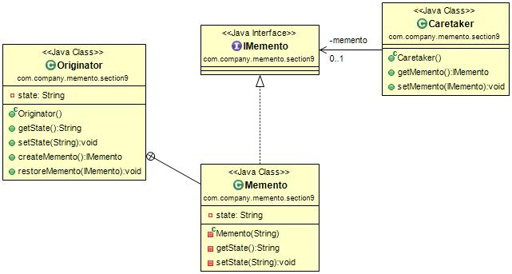

#备忘录模式(Memento Pattern) 
 定义：Without violating encapsulation, capture and externalize an object's internal state so that the object can be restored to this state later.（在不破坏封装性的前提下，捕获一个对象的内部状态，并在该对象之外保存这个状态。这样以后就可将该对象恢复到原先保存的状态。）  

 备忘录模式的通用类图如图所示。  

我们来看看类图中的三个角色。

- Originator发起人角色：记录当前时刻的内部状态，负责定义哪些属于备份范围的状态，负责创建和恢复备忘录数据。
- Memento备忘录角色：负责存储Originator发起人对象的内部状态，在需要的时候提供发起人需要的内部状态。
- Caretaker备忘录管理员角色：对备忘录进行管理、保存和提供备忘录。

#备忘录模式的应用
##1.备忘录模式的使用场景
 * 需要保存和恢复数据的相关状态场景。
 * 提供一个可回滚的操作；比如word中的CTRL+Z组合键，IE浏览器中的后退按钮，文件管理器上的backspace键等。
 * 需要监控的副本场景中。例如监控一个对象的属性，但是监控又不应该作为系统的主业务来调用，它只是边缘应用，即使出现监控不准、错误报警也影响不大，因此一般的做法是备份一个主线程中的对象，然后由分析程序来分析。
 * 数据库连接的事务管理就是用的备忘录模式。

##2.备忘录模式的注意事项 
 * 备忘录的生命期：备忘录创建出来就要在“最近”的代码中使用，要主动管理它的生命周期，建立就要使用，不适用就要立刻删除其引用，等待垃圾回收器对它的回收处理。
 * 备忘录的性能：不要在频繁建立备份的场景中使用备忘录模式(比如一个for循环中)，原因有二：一是控制不了备忘录建立的对象数量，二是大对象的建立要消耗资源的，系统的性能需要考虑。
 
##3.备忘录模式的扩展
 * clone方式的备忘录
 * 多状态的备忘录模式
 * 多备份的备忘录 