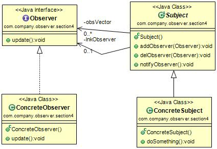

#观察者模式(Observer Pattern) 
 定义：Define a one-to-many dependency between objects so that when one object changes state, all its dependents are notified and updated automatically.（定义对象间一种一对多的依赖关系，使得每当一个对象改变状态，则所有依赖于它的对象都会得到通知并被自动更新。）  

观察者模式的通用类图如下图：  

 我们先来解释一下观察者模式的几个角色名称：

- Subject被观察者：定义被观察者必须实现的职责，它必须能够动态地增加、取消观察者。它一般是抽象类或者是实现类，仅仅完成作为被观察这必须实现的职责：管理观察者并通知观察者。
- Observer观察者：观察者接收到消息后，机进行update(更新方法)操作，对接收到的信息进行处理。
- ConcreteSubject具体的被观察者：定义被观察者自己的业务逻辑，同时定义对哪些事情进行通知。
- ConcreteObserver具体的观察者：每个观察在接收到消息后的处理反应是不同，各个观察者有自己的处理逻辑。

#观察者模式的应用
##1.观察者模式的优点
 * 观察者和被观察者之间是抽象耦合：如此设计，则不管是观察者还是被观察者都非常容易扩展，而且在Java中都已经实现的抽象层级的定义，在系统扩展方面更是得心应手。
 * 建立一套触发机制。

##2.观察者模式的缺点 
观察者模式需要考虑一下开发效率和运行效率问题，一个被观察者，多个观察者，开发和调试就会比较复杂，而且在Java中消息的通知默认是顺序执行，一个观察者卡壳，会影响整体的执行效率。在这种情况下，一般考虑采用异步的方式。  
多级触发时效率更是让人担忧，大家在设计时注意考虑。  

##3.观察者模式的使用场景
 * 关联行为场景。需要注意的是，关联行为是可拆分的，而不是“组合”关系。
 * 事件多级触发场景。
 * 跨系统的消息交换场景，如消息队列的处理机制。

##4.观察者模式的注意事项
 * 广播链的问题。
 * 异步处理问题。 