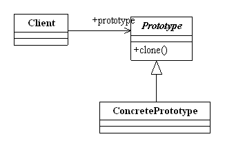

#原型模式(Proxy Pattern) 
定义：Specify the kinds of objects to create using a prototypical instance, and create new objects by copying this prototype. 用原型实例指定创建对象的种类，并且通过拷贝这些原型创建新的对象。  

原型模式的通用类图如下图：  

原型模式的核心是一个clone方法，通过该方法进行对象的拷贝，Java提供了一个Cloneable接口来标示这个对象是可拷贝的，为什么说是“标示”呢？翻开JDK的帮助看看Cloneable是一个方法都没有的，这个接口只是一个标记作用，在JVM中具有这个标记的对象才有可能被拷贝，那怎么才能从“有可能被拷贝”转换为“可以被拷贝”呢？方法是覆盖clone()方法。实现一个接口，然后重写clone方法，就完成了原型模式！  

#原型模式的应用
##原型模式的优点
 * 性能优良。原型模式是在内存二进制流的拷贝，要比直接new一个对象性能好很多，特别是要在一个循环体内产生大量的对象时，原型模式可以更好的体现其优点。 
 * 逃避构造函数的约束。这既是它的优点也是缺点，直接在内存中拷贝，构造函数是不会执行的（见“原型模式的注意事项”），优点就是减少了约束，缺点也是减少了约束，双刃剑，需要大家在实际应用时考虑。

##原型模式的使用场景
 * 资源优化场景。类初始化需要消化非常多的资源，这个资源包括数据、硬件资源等。
 * 性能和安全要求的场景。通过new产生一个对象需要非常繁琐的数据准备或访问权限，则可以使用原型模式。
 * 一个对象多个修改者的场景。一个对象需要提供给其他对象访问，而且各个调用者可能都需要修改其值时，可以考虑使用原型模式拷贝多个对象供调用者使用。 
 
在实际项目中，原型模式很少单独出现，一般是和工厂方法模式一起出现，通过clone的方法创建一个对象，然后由工厂方法提供给调用者。原型模式已经与Java融为浑然一体，大家可以随手拿来使用。       

 
#原型模式的注意事项
 * 构造函数不会被执行。
 * 浅拷贝和深拷贝。Object类提供的方法clone只是拷贝本对象，其对象内部的数组、引用对象等都不拷贝，还是指向原生对象的内部元素地址，这种拷贝就叫做浅拷贝，确实是非常浅，两个对象共享了一个私有变量，你改我改大家都能改，是一种非常不安全的方式，在实际项目中使用还是比较少的（当然，这是也是一种“危机”环境的一种救命方式）。内部的数组和引用对象才不拷贝，其他的原始类型比如int,long,String(Java就希望你把String认为是基本类型，String是没有clone方法的)等都会被拷贝的。(注意：使用clone方法拷贝时，满足两个条件的对象才不会被拷贝：一是类的成员变量，而不是方法内的变量；二是必须是一个对象，而不是一个原始类型)
 * clone与final两对冤家。对象的clone与对象内的final关键字是有冲突的。要使用clone方法，类的成员变量上不要增加final关键字。