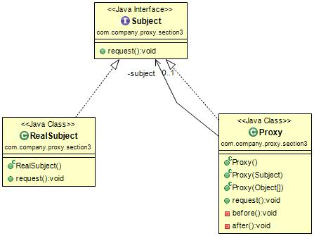
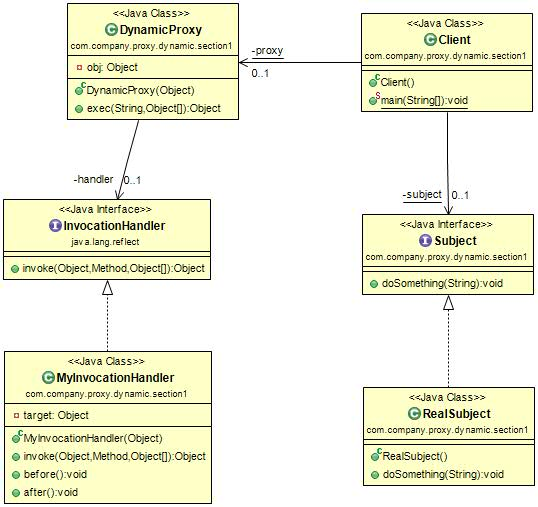

#代理模式(Proxy Pattern) 
定义：provide a surrogate or placeholder for another object to control access to it.为其他对象提供一种代理以控制对这个对象的访问。  

代理模式的通用类图如下图：  

代理模式也叫做委托模式，它是一项基本设计技巧，许多其他的模式，如状态模式、策略模式、访问者模式本质上是在更特殊的场合采用了委托模式，而且在日常的应用中，代理模式可以提供非常好的访问控制，在一些著名开源软件中也经常见到它的身影，如Struts2的Form元素映射就采用了代理模式（准确的说是动态代理模式）。我们先看一下类图中的三个角色的定义：

- Subject抽象主题角色。抽象主题类可以是抽象类也可以是接口，是一个最普通的业务类型定义，无特殊要求。
- RealSubject 具体主题角色。也叫做被委托角色、被代理角色，它才是冤大头，是业务逻辑的具体执行者。 
- Proxy代理主题角色。也叫做委托类、代理类，它负责对真实角色的应用，把所有抽象主题类定义的方法限制委托给真实主题角色实现，并且在真实主题角色处理完毕前后做预处理和善后处理工作。

#代理模式的应用
##代理模式的优点
 * 职责清晰。真实的角色就是实现实际的业务逻辑，不用关心其他非本职责的事务，通过后期的代理完成一件完成事务，附带的结果就是编程简洁清晰。 
 * 高扩展性。具体主题角色是随时都会发生变化的，只要它实现了接口，甭管它如何变化，都逃不脱如来佛的手掌（接口），那我们的代理类完全就可以在不做任何修改的情况下使用。
 * 智能化。这在我们以上讲解中还没有体现出来，不过在我们以下的动态代理章节中你就会看到代理的智能化，读者有兴趣也可以看看Struts是如何把表单元素映射到对象上的。 
 
##代理模式的应用
我相信第一次接触到代理模式的读者肯定很郁闷，为什么要用代理呀，是的，为什么要用代理？想想现实世界吧，你为什么要找代理律师，你去打官司，为什么要找个律师？因为你不想参与中间过程的是是非非，只要完成自己的答辩就成，其他的比如事前调查、事后追查都由律师来搞定，这就是为了减轻你的负担。代理模式使用非常多，大家可以看看Spring AOP，这是一个非常典型的动态代理。  

 
#代理模式的扩展
##普通代理
 在网络上代理服务器设置分为透明代理和普通代理，是什么意思呢？透明代理就是用户不用设置代理服务器地址，就可以直接访问，也就是说代理服务器对用户来说透明的，看不到，不用知道它存在的；普通代理则是需要用户自己设置代理服务器的IP地址，用户必须知道代理的存在。我们设计模式中的普通代理和强制代理也是类似的一种结构，普通代理就是我们要知道代理的存在，也就是类似的GamePlayerProxy这个类的存在，然后才能访问；强制代理则是调用者直接调用真实角色，而不用关心代理是否存在，其代理的产生是由真实角色决定的，这样解释还是比较复杂，我们还是用实例来讲解。  

首先说普通代理，它的要求就是客户端只能访问代理角色，而不能访问真实角色。在该模式下，调用者只知代理而不用知道真实的角色是谁，屏蔽了真实角色的变更对高层模块的影响，真实的主题角色爱怎么修改就怎么修改，对高层次的模块没有任何的影响，只要你实现了接口所对应的方法，该模式非常适合对扩展性要求较高的场合。当然，在实际的项目中，一般都是通过约定来禁止new一个真实的角色，也是一个非常好的方案。  

    注意：普通代理模式的约束问题，尽量通过团队内的编程规范类约束，因为每一个主题类是可被重用的和可维护的，使用技术约束的方式对系统维护是一种非常不利的因素。

##强制代理
强制代理在设计模式中比较另类，为什么这么说呢？一般的思维都是通过代理找到真实的角色，但是强制代理却是要“强制”，你必须通过真实角色查找到代理角色，否则你不能访问，甭管你是通过代理类还是通过直接new一个主题角色类，都不能访问，只有通过真实角色指定的代理类才可以访问，也就是说由真实角色管理代理角色，这么说吧，高层模块new了一个真实角色的对象，返回的却是代理角色。  

强制代理的概念就是要从真实角色查找到代理角色，不允许直接访问真实角色，高层模块只要调用getProxy就可以访问真实角色的所有方法，它根本就不需要产生一个代理出来，代理的管理已经由真实角色自己完成。  

##代理是有个性的
一个类可以实现多个接口，完成不同任务的整合，那也就是说代理类不仅仅可以实现主题接口，也可以实现其他接口完成不同的任务，而且代理的目的是在目标对象方法的基础上作增强，这种增强的本质通常就是对目标对象的方法进行拦截和过滤。例如游戏代理是需要收费的，升一级需要5元钱，这个计算功能就是代理类的个性，它应该在代理的接口中定义。  

##虚拟代理
虚拟代理(Virual Proxy)只要我们把代理模式的通用代码稍微修改一下就成为虚拟代理。在需要的时候才初始化主题对象，可以避免被代理对象较多而引起的初始化缓慢的问题，它的缺点就是需要在每个方法中判断主题对象是否被创建，这就是虚拟代理，非常简单。  

##动态代理
动态代理模式的通用类图如下图：  

动态代理是在实现阶段不用关心代理谁，而在运行阶段才指定代理那一个对象，相对的来说，自己写代理类的方式就是静态代理。现在有一个非常流行的名称叫做：面向横切面编程，也就是AOP（Aspect Oriented Programming），其核心就是采用了动态代理机制。  

在类图中有一个InvocationHanlder接口，是JDK提供的动态代理接口，对被代理类的方法进行代理。其中invoke方法是接口InvocationHandler定义必须实现的，它完成对真实方法的调用。我们来详细讲解一下InvocationHanlder接口，动态代理是根据被代理的接口生成所有的方法，也就是说给定一个接口，动态代理会宣称“我已经实现该接口下的所有方法了”，那各位读者想想看，动态代理怎么才能实现被代理接口中的方法呢？默认情况下所有的方法返回值都是空的，是的，代理已经实现它了，但是没有任何的逻辑含义，那怎么办？好办，通过InvocationHandler接口，所有方法都由该Handler来进行处理，即所有被代理的方法都由InvocationHandler接管实际的处理任务。  

     注意：要实现动态代理的首要条件是：被代理类必须实现一个接口。当然了，现在也有很多技术如CGLIB可以实现不需要接口也可以实现动态代理的方式。  

再次说明，以上的动态代理是一个通用代理框架，如果你想设计自己的AOP框架，完全可以在此基础上扩展，我们设计的是一个通用代理，只要有一个接口，一个实现类，就可以使用该代理，完成代理的所有功效。