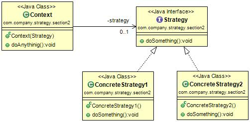

#策略模式(Strategy Pattern) 
定义：Define a family of algorithms, encapsulate each one, and make them interchangeable.（定义一组算法，将每个算法都封装起来，并且使它们之间可以互换。）  

策略模式的通用类图如下图：  

策略模式使用的就是面向对象的继承和多态机制，非常容易理解和掌握，我们再来看策略模式的三个角色。

- Context角色：起承上启下封装作用，屏蔽高层模块对策略、算法的直接访问，封装可能存在的变化。
- Strategy抽象策略角色：策略、算法家族的抽象，通常为接口，定义每个策略或算法必须具有的方法和属性。
- ConcreteStrategy具体策略角色：实现抽象策略中的操作，该类含有具体的算法。

#策略模式的应用
##1.策略模式的优点
 * 算法可以自由切换。
 * 避免使用多重条件判断。
 * 扩展性良好。

##2.策略模式的缺点 
 * 策略类数量增多：每一个策略都是一个类，复用的可能性很小，类数量增多。
 * 所有的策略类都需要对外暴露。上层模块必须知道有哪些策略，然后才能决定使用哪一种策略，这与迪米特法则是相违背的，我只是想使用一个策略，我凭什么就要了解这个策略呢？那要你的封装类还有什么意义？这是原装策略模式的一个缺点，幸运的是，我们可以使用其他模式来修正这个缺陷，如果工厂方法模式、代理模式或享元模式。

##3.策略模式的使用场景
 * 多个类只有在算法或行为上稍有不同的场景。
 * 算法需要自由切换的场景。
 * 需要屏蔽算法规则的场景。
 
##4.策略模式的注意事项
如果系统中的一个策略家族的具体策略数量超过4个，则需要考虑使用混合模式，解决策略类膨胀和对外暴露的问题，否则日后的系统维护就会变成一个烫手山芋。 