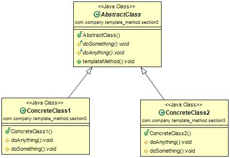

#模板方法模式(Template Method Pattern) 
定义：Define the skeleton of an algorithm in an operation, deferring some steps to subclasses. Template Method lets subclasses redefine certain steps of an algorithm without changing the algorithm's structure。定义一个操作中的算法的骨架，而将一些步骤延迟到子类中。使得子类可以不改变一个算法的结构即可重定义该算法的某些特定步骤。  

模板方法模式的通用类图如下图：  

模板方法模式确实非常简单，仅仅使用了Java的继承机制，但是它是一个应用非常广泛的模式。其中，AbstractClass叫做抽象模板，它的方法分为两类：

- 基本方法。基本方法也叫做基本操作，是由子类实现的方法，并且在模板方法被调用。
- 模板方法。可以有一个或几个，一般是一个具体方法，也就是一个骨架，实现对基本方法的调度，完成固定的逻辑。

在类图中还有一个角色：具体模板，ConcreteClass1和ConcreteClass2属于具体模板，实现父类所定义的一个或多个抽象方法，也就是父类定义的基本方法在子类中得以实现。  

     注意：为了防止恶意的操作，一般模板方法都加上final关键字，不允许被覆写。  

#模板方法模式的应用
##模板方法模式的优点
 * 封装不变部分，扩展可变部分。把认为是不变部分的算法封装到父类实现，而可变部分的则可以通过继承来继续扩展。我们悍马模型例子中，是不是就非常容易扩展，例如增加一个H3型号的悍马模型，很容易呀，增加一个子类，实现父类的基本方法就可以了。
 * 提取公共部分代码，便于维护。我们例子中刚刚走过的弯路就是最好的证明，如果我们不抽取到父类中，任由这种散乱的代码发生，想想后果是什么样子？维护人员为了修正一个缺陷，需要到处查找类似的代码！
 * 行为控制交由子类来实现。基本方法是由子类实现的，因此子类可以通过扩展的方式增加相应的功能，符合开闭原则。
 
 
##模板方法模式的缺点
按照我们设计习惯，抽象类负责声明最抽象、最一般的事物属性和方法，实现类完成具体的事物属性和方法，但是模板方法模式却颠倒了，抽象类定义了部分抽象方法，由子类实现，子类执行的结果影响了父类的结果，也就是子类对父类产生了影响，这在复杂的项目中，会带来代码阅读的难度，而且也会让新手产生不适感。  
       

#模板方法模式的使用场景
 * 多个子类有公有的方法，并且逻辑基本相同时。
 * 重要、复杂的算法，可以把核心算法设计为模板方法，周边的相关细节功能则由各个子类实现。
 * 重构时，模板方法模式是一个经常使用的模式，把相同的代码抽取到父类中，然后通过钩子函数（见“模板方法模式的扩展”）约束其行为。            