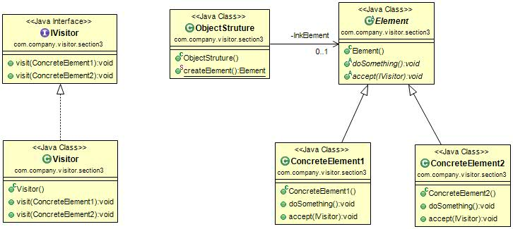

#访问者模式(Visitor Pattern) 
定义：Represent an operation to be performed on the elements of an object structure. Visitor lets you define a new operation without changing the classes of the elements on which it operations.（封装一些作用于某种数据结构中的各元素的操作，它可以在不改变数据结构的前提下定义作用于这些元素的新的操作。）  

访问者模式的通用类图如下图：  

我们来看看这几个角色的职责。

- IVisitor抽象访问者：抽象类或者接口，声明访问者可以访问哪些元素，具体到程序中就是visit方法的参数定义哪些对象是可以被访问的。
- Visitor具体访问者：它影响访问者访问到一个类后该怎么干，要做什么事情。
- Element抽象元素：接口或者抽象类，声明接受哪一类访问者访问，程序上通过accept方法中的参数来定义的。
- ConcreteElement具体元素：实现accept方法，通常是visitor.visit(this)，基本上都形成了一种模式了。
- ObjectStruture结构对象：元素产生者，一般容纳在多个不同类、不同接口的容器，如List、Set、Map等，在项目中，一般很少抽象出这个角色。

#访问者模式的应用
##1.访问者模式的优点
 * 符合单一职责原则：具体元素角色也就是抽象类的两个子类负责数据的加载，而Visitor类则负责报表的展现，两个不同的职责非常明确地分离开来，各自演绎变化。
 * 优秀的扩展性：由于职责分开，继续增加对数据的操作是非常快捷的。
 * 灵活性非常高。

##2.访问者模式的缺点 
 * 具体元素对访问者公布细节：访问者要访问一个类就必然要求这个类公布一些方法和数据，也就是说访问者关注了其他类的内部细节，这是迪米特法则所不建议的。
 * 具体元素变更比较困难。
 * 违背了依赖倒置原则：访问者依赖的是具体元素，而不是抽象元素，这破坏了依赖倒置原则，特别是在面向对象的编程中，抛弃了对接口的依赖，而直接依赖实现类，扩展比较难。

##3.访问者模式的使用场景
 * 一个对象结构包含很多类对象，它们有不同的接口，而你想对这些对象实施一些依赖于其具体类的操作，也就是用迭代器模式已经不能胜任的情景。
 * 需要对一个对象结构中的对象进行很多不同并且不相关的操作，而你想避免让这些操作“污染”这些对象的类。

总结一下，在这种地方你一定要考虑使用访问者模式：业务规则要求遍历多个不同的对象。这本书也是访问者模式出发点，迭代器模式只能访问同类或同接口的数据，而访问者模式是对迭代器模式的扩充，可以遍历不同的对象，然后执行不同的操作，也就是针对访问的对象不同，执行不同操作。访问者模式还有一个用途，就是冲动拦截器角色。  

 
##4.访问者模式的最佳实践
访问者模式是一种集中规整模式，特别适用于大规模重构的项目，在这一个阶段需求已经非常清晰，原系统的功能点也已经明确，通过访问者模式可以很容易把一些功能进行梳理，达到最终目的——功能集中化，如一个统一的报表运算、UI展现等，我们还可以与其它模式混编建立一套自己的过滤器或者拦截器。 